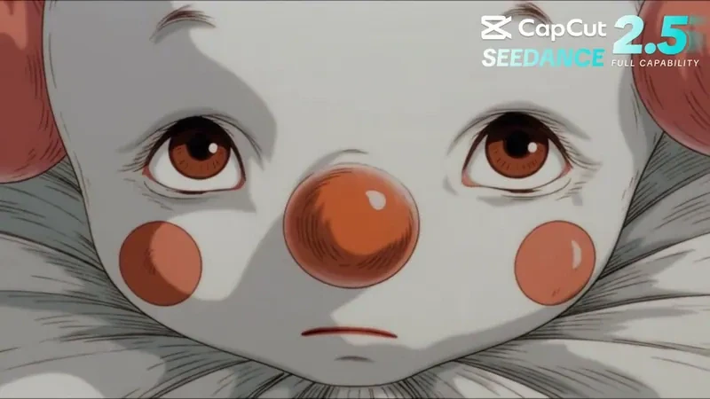
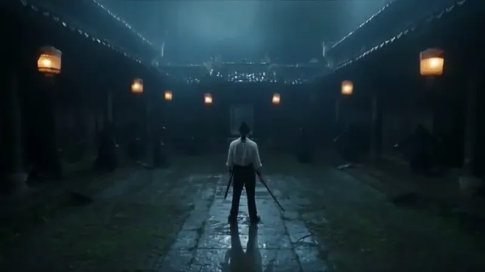
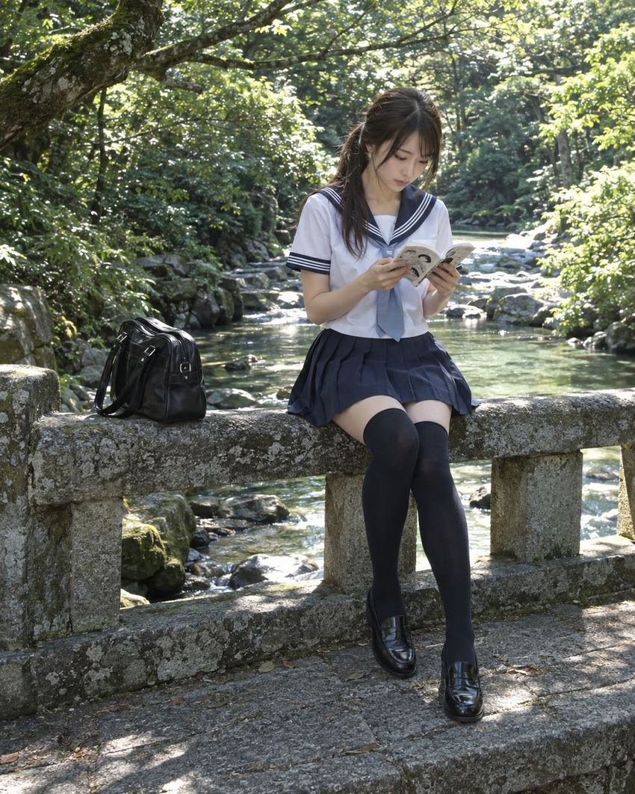
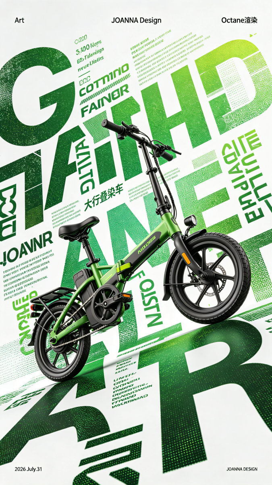

# PromptDirector 精选案例

**先看作品，再看提示词与来源。** 这里公开展示由 PromptDirector 收集、整理并审核的视觉创作案例；浏览无需安装插件，需要长期保存时再放进自己的本地资料库。

**1,400+ 条已发布案例条目 · 19 个合集**，涵盖 Seedance 2.5 视频、GPT Image 2 相关图像提示词、Midjourney、即梦及更多视觉创作方向。数字来自[公开目录](https://wchao6891.github.io/PromptDirector-Curated/public-catalog.json)的合集计数，未跨合集去重。

[浏览全部案例](https://wchao6891.github.io/PromptDirector-Curated/) · [浏览精选 Skill](https://wchao6891.github.io/PromptDirector-Curated/skills.html) · [安装 PromptDirector](https://chromewebstore.google.com/detail/iahakaahijddcjjldidbclicedibgpjm) · [查看插件源码](https://github.com/wchao6891/PromptDirector)

## 从作品开始

以下均是已公开的案例。点击封面可打开**所在合集**，继续查看提示词、原作者与来源；第三方作品的权利状态见案例详情及下方说明。

### 视频 · Seedance 2.5

| | | |
|:---:|:---:|:---:|
| <a href="https://wchao6891.github.io/PromptDirector-Curated/?pack=featured%3Aevolink-video-1"> 1990s OVA Cel-Style Character Action</a> @roco_kn_roco | <a href="https://wchao6891.github.io/PromptDirector-Curated/?pack=featured%3Aevolink-video-2"> Crystal Ball Match-Cut Montage</a> | <a href="https://wchao6891.github.io/PromptDirector-Curated/?pack=featured%3Aevolink-video-2"> Cyber-Wuxia Series Trailer</a> @TanLuAI |
| <a href="https://wchao6891.github.io/PromptDirector-Curated/?pack=featured%3Aevolink-video-2"> Desert Lizard Grapefruit Ad</a> | <a href="https://wchao6891.github.io/PromptDirector-Curated/?pack=featured%3Aevolink-video-5"> Three-Minute Rain Temple Swordfight</a> @baqiceloudezhu | <a href="https://wchao6891.github.io/PromptDirector-Curated/?pack=featured%3Aevolink-video-5"> Trojan War Selfie Vlog</a> @bmx_ai13 |

### 图像 · GPT Image 2 相关

| | | |
|:---:|:---:|:---:|
| <a href="https://wchao6891.github.io/PromptDirector-Curated/?pack=cases-5b8deb5b7d94e3bcdefb"> ChatGPT image2 x 异世界茶屋提示词</a> anomo | <a href="https://wchao6891.github.io/PromptDirector-Curated/?pack=cases-5b8deb5b7d94e3bcdefb"> 夏日森林里，偷走一小时的安静</a> anomo | <a href="https://wchao6891.github.io/PromptDirector-Curated/?pack=cases-a7126fd0ce35aaf96153"> 霓虹猫娘汽水海报</a> |

### 图像 · Midjourney

| | | |
|:---:|:---:|:---:|
| <a href="https://wchao6891.github.io/PromptDirector-Curated/?pack=featured%3Aaiartworks-mj"> AIArtWorks · @zeus8698</a> | <a href="https://wchao6891.github.io/PromptDirector-Curated/?pack=featured%3Aaiartworks-mj"> AIArtWorks · @desp_450</a> | <a href="https://wchao6891.github.io/PromptDirector-Curated/?pack=featured%3Aaiartworks-mj"> AIArtWorks · @loreaao</a> |

### 图像 · 国风与商业创作

| | | |
|:---:|:---:|:---:|
| <a href="https://wchao6891.github.io/PromptDirector-Curated/?pack=featured%3Avol-1"> 天宫仙班压阵</a> 原创 | <a href="https://wchao6891.github.io/PromptDirector-Curated/?pack=featured%3Avol-1"> 狐火纸影</a> 原创 | <a href="https://wchao6891.github.io/PromptDirector-Curated/?pack=cases-1ea9f7e33e0b293d2a12"> 手工皂产品静物摄影</a> |
| <a href="https://wchao6891.github.io/PromptDirector-Curated/?pack=cases-f05a7604a4a889ede786"> 折叠车 创意海报</a> Joanna...z | <a href="https://wchao6891.github.io/PromptDirector-Curated/?pack=featured%3Ajimeng-guofeng-community-1"> 即梦 · @用户San川cg</a> | <a href="https://wchao6891.github.io/PromptDirector-Curated/?pack=cases-3067eed17c7b7ca7d1b3"> 幻想花灵风格，月影花冠-AI提示词分享</a> |

## 浏览全部合集

以下是当前公开目录的 19 个合集。案例新增或下架后，以[在线目录](https://wchao6891.github.io/PromptDirector-Curated/)为准。

| 合集 | 类型 | 案例条目 |
| --- | --- | ---: |
| [Vol.1 原创国风视觉](https://wchao6891.github.io/PromptDirector-Curated/?pack=featured%3Avol-1) | 图片 | 20 |
| [Vol.2 即梦精选案例](https://wchao6891.github.io/PromptDirector-Curated/?pack=featured%3Ajimeng) | 图片 | 150 |
| [Vol.3 AIArtWorks 精选案例](https://wchao6891.github.io/PromptDirector-Curated/?pack=featured%3Aaiartworks-mj) | 图片 | 81 |
| [Vol.4 Higgsfield 精选案例](https://wchao6891.github.io/PromptDirector-Curated/?pack=featured%3Ahiggsfield) | 图片 | 56 |
| [EvoLink 精选视频案例 · 1/5](https://wchao6891.github.io/PromptDirector-Curated/?pack=featured%3Aevolink-video-1) | 视频 | 27 |
| [EvoLink 精选视频案例 · 2/5](https://wchao6891.github.io/PromptDirector-Curated/?pack=featured%3Aevolink-video-2) | 视频 | 30 |
| [EvoLink 精选视频案例 · 3/5](https://wchao6891.github.io/PromptDirector-Curated/?pack=featured%3Aevolink-video-3) | 视频 | 25 |
| [EvoLink 精选视频案例 · 4/5](https://wchao6891.github.io/PromptDirector-Curated/?pack=featured%3Aevolink-video-4) | 视频 | 31 |
| [EvoLink 精选视频案例 · 5/5](https://wchao6891.github.io/PromptDirector-Curated/?pack=featured%3Aevolink-video-5) | 视频 | 9 |
| [即梦国风投稿精选 · 第 1 期](https://wchao6891.github.io/PromptDirector-Curated/?pack=featured%3Ajimeng-guofeng-community-1) | 图片 | 38 |
| [即梦精选-国风视觉第二期](https://wchao6891.github.io/PromptDirector-Curated/?pack=cases-85fe274e06c395c24e8a) | 图片 | 112 |
| [即梦精选-视觉设定集](https://wchao6891.github.io/PromptDirector-Curated/?pack=cases-1ceeb0d9bc533bf10bcc) | 图片 | 121 |
| [即梦精选-电商广告](https://wchao6891.github.io/PromptDirector-Curated/?pack=cases-1ea9f7e33e0b293d2a12) | 图片 | 100 |
| [PromptDirector-即梦精选-海报-分享](https://wchao6891.github.io/PromptDirector-Curated/?pack=cases-4529f91713cffcfe4dc1) | 图片 | 100 |
| [即梦精选-品牌设计](https://wchao6891.github.io/PromptDirector-Curated/?pack=cases-f05a7604a4a889ede786) | 图片 | 100 |
| [即梦精选-灵感系列](https://wchao6891.github.io/PromptDirector-Curated/?pack=cases-ed99fb86238d9dca13c0) | 图片 | 91 |
| [小黑盒精选焚诀](https://wchao6891.github.io/PromptDirector-Curated/?pack=cases-5b8deb5b7d94e3bcdefb) | 图片 | 113 |
| [小黑盒精选案例](https://wchao6891.github.io/PromptDirector-Curated/?pack=cases-a7126fd0ce35aaf96153) | 图片 | 162 |
| [小黑盒-高定服饰](https://wchao6891.github.io/PromptDirector-Curated/?pack=cases-3067eed17c7b7ca7d1b3) | 图片 | 48 |

## 怎么使用

1. 直接打开[精选案例网站](https://wchao6891.github.io/PromptDirector-Curated/)浏览作品、原词和来源，无需安装。
2. 想保留完整资料时，下载审核后的案例包，或安装 [PromptDirector](https://chromewebstore.google.com/detail/iahakaahijddcjjldidbclicedibgpjm) 保存到自己的本地资料库。
3. 在自己的项目里整理、比较和复用案例；私人资料不会因浏览这个公开仓库而上传。

这个仓库只保存公开精选目录、预览和发布材料。插件源码在 [PromptDirector](https://github.com/wchao6891/PromptDirector)；私人案例、评测资料、同步数据和 API 密钥不属于本仓库。

## 权利与下架

公开目录由维护者人工决定收录原创、已授权及第三方来源精选。第三方来源精选保留原作者和来源，明确标注“授权未核验”；维护者批准上架不等于取得原作者授权。每个公开包绑定与当前版本一致的来源与权利状态记录。完整说明见 [RIGHTS.md](RIGHTS.md)。

权利人可通过 [权利反馈 Issue](https://github.com/wchao6891/PromptDirector-Curated/issues/new?template=rights-report.yml) 联系维护者核实与下架。

## 发布流程

1. 投稿者在 PromptDirector 的分享弹层选择“投稿到精选”。插件只导出所选图片或视频案例的公开字段和媒体；大包会自动生成多个可分别上传的 ZIP。
2. 投稿者打开插件提供的 GitHub 表单，一次选择全部投稿文件，并确认素材将进入公开审核队列。
3. GitHub Action 只读检查附件域名、分卷与 SHA-256、ZIP 路径和大小、媒体文件头、图片尺寸、H.264 视频及来源字段；提示词和上传内容不会被执行。
4. 预检通过后，维护者人工复核案例质量、重复内容、隐私、权利与敏感内容。投稿不会自动发布。
5. 维护者选择通过的案例并整理合集、来源与权利信息，生成保留原始媒体的下载包与独立网站缩略图。
6. 通过审核的 ZIP 作为 GitHub Release 附件发布。
7. 使用审核后的 ZIP 生成 `site/previews/` 只读预览；视频从同一审核包提取后作为发布附件提供，按摘要核对并禁止覆盖，提示词只作为文字展示和复制。
8. 发布时提交封面、只读预览、权利记录和带 SHA-256 校验值的目录；网站部署后核对线上结果。
9. GitHub Action 从 Release Asset API 更新经过摘要核对的累计下载量；失败时不覆盖上次真实快照。

目录不会自动收录投稿。普通用户不需要 Git、API、命令行或仓库权限，但需要 GitHub 账号提交附件。产品不提供点赞、评论、公开粉丝数或算法排行榜；关注只保存在当前设备。

第三方来源精选须经维护者人工批准，保留逐案例署名与来源，并如实记录授权状态。投稿者不能替原作者授予许可。

## 精选 Skill 流程

1. 投稿者在 PromptDirector 的 Skill 详情页选择“投稿到精选 Skill”，检查成果封面、最终文件清单、全文和隐私提示。
2. 插件下载独立投稿包并打开 GitHub 投稿表单；不会自动创建公开版本。
3. 投稿方法和封面固定使用 CC BY 4.0；GitHub Action 只做结构、安全、摘要和公开字段预检，不执行包内内容，也不自动发布。
4. 维护者人工审核方法质量、封面对应关系、图片公开授权、重复、公开署名、隐私和安全边界；确认通过时，由仓库所有者给投稿 Issue 添加“批准发布”标签。
5. 串行发布流程会重新下载并预检附件，分配稳定作者编号和版本，为每个 `skillId@version` 创建独立不可变 Release，更新 `site/skills-catalog.json` 并显式部署 Pages。首版为 `1.0.0`，新内容递增补丁版本，相同内容安全复用既有版本。
6. 只有 Release、目录提交和 Pages 部署全部成功后，流程才会添加 `published` 标签并关闭 Issue；失败会保持 Issue 开启，且不会伪装成发布成功。
7. 公共站点只提供浏览与下载；扩展在保存前再次验证地址、大小、摘要、包身份、方法及图片边界。同版本重复保存保持幂等，新版本另存，不覆盖本地修改。

精选 Skill 投稿包含 `SKILL.md`、声明的 Markdown references，以及一张 `assets/cover.*` 成果图片。图片随 Skill 保存、下载和备份；不执行包内程序。历史无封面包继续可读取，新投稿须补齐封面。

封面格式与文件上限沿用插件的 Skill 包规则。共享资源由插件仓库的 `tools/sync-skill-cover-site.mjs` 同步到本仓库 `site` 目录；同步后可用 `--check` 核对，避免网站和插件各自维护图片规则。

## 界面用语

- 下载 ZIP：网页把完整审核包下载到电脑，不写入私人库。
- 保存整包：插件把完整审核包校验后写入私人库，并建立同名精选项目。
- 保存案例：插件只把当前案例及完整媒体写入私人库。
- 在线预览视频：从只读 Media Release 播放，不会自动保存。
- 本地保存视频：从原始审核 ZIP 校验并提取完整视频。
- 精选项目：私人库中用于归组同一公开精选包的本地项目。

公共网页读取 `site/public-catalog.json`。已发布插件仍读取 `site/catalog.json`，该接口保留其支持的授权状态，避免现有安装版拒绝整个目录。此兼容分离在插件支持新授权状态并完成安装版验收后再统一；恢复的完整案例包可直接在网页下载并手动导入。
